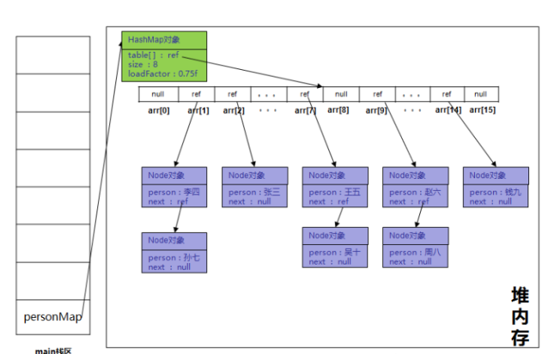

HashMap 最早出现在 JDK 1.2中，底层基于散列算法实现。HashMap 允许 null 键和 null 值，在计算哈键的哈希值时，null 键哈希值为 0。HashMap 并不保证键值对的顺序，这意味着在进行某些操作后，键值对的顺序可能会发生变化。另外，需要注意的是，HashMap 是非线程安全类，在多线程环境下可能会存在问题。

# 1. HashMap初始化

先来看看HashMap在Map这个大家族中的位置:


先简单的说一下这几个Map，TreeMap是基于树的实现，HashMap，HashTable，ConcurrentHashMap是基于hash表的实现，下文我们会介绍hash表。HashTable和HashMap在代码实现上，基本上是一样的，和Vector与Arraylist的区别大体上差不多，一个是线程安全的，一个非线程安全，忘记了的朋友可以去看这篇文章，传送门：[Arraylist与Vector的区别](https://zhuanlan.zhihu.com/p/28241176)。ConcurrentHashMap也是线程安全的，但性能比HashTable好很多，HashTable是锁整个Map对象，而ConcurrentHashMap是锁Map的部分结构.

Map其实很简单，就是一个key，对应一个value。


代码实现如下:

```Java
public class HashMapTest {
    public static void main(String[] args) {
        Map<String, Person> personMap = new HashMap<String, Person>();
        personMap.put("张三",new Person("张三",21));
        personMap.put("李四",new Person("李四",19));
        personMap.put("王五",new Person("王五",25));
        personMap.put("赵六",new Person("赵六",24));
        personMap.put("孙七",new Person("孙七",32));
        personMap.put("周八",new Person("周八",17));
        personMap.put("钱九",new Person("钱九",24));
        personMap.put("吴十",new Person("吴十",23));
        
        System.out.println("personMap.size()" + personMap.size());
    }
}
```

执行构造函数，当我们看到这个new，第一反应应该是这货又在堆内存里开辟了一块空间

```Java
Map<String, Person> personMap = new HashMap<>();
```

源码中构造函数如下：

```Java
public HashMap() {
   this.loadFactor = DEFAULT_LOAD_FACTOR; // all other fields defaulted
}
```

似乎简单，就是初始化了一个负载因子,负载因子默认为0.75f

```java
/**
 * The load factor used when none specified in constructor.
 * 在构造函数中未指定时使用的负载系数。
 */
static final float DEFAULT_LOAD_FACTOR = 0.75f;
```

在源码中看到了的数组，数组里原对象是Node

```Java
transient Node<K,V>[] table;
```

看看Node是什么

```Java
static class Node<K,V> implements Map.Entry<K,V> {
        final int hash;
        final K key;
        V value;
        Node<K,V> next;

    	//构造函数
        Node(int hash, K key, V value, Node<K,V> next) {
            this.hash = hash;
            this.key = key;
            this.value = value;
            this.next = next;
        }
```

其实很简单，一些属性，一个key，一个value，用来保存我们往Map里放入的数据，next用来标记Node节点的下一个元素。

```java
transient int size;	//逻辑长度

transient int modCount;	//修改次数
```

这两个一个是逻辑长度，一个是修改次数，ArrayList，LinkedList也有这两个属性，如下图:


HashMap我们就初始化好了，成员变量table数组默认为null，size默认为0，负载因子为0.75f，初始化完成.

# 2. HashMap中元素添加

往里添加元素，来看一下put的源码

```Java
public V put(K key, V value) {
    return putVal(hash(key), key, value, false, true);
}
```

就一行代码，调用了putVal方法，其中key是传进来的“张三”这个字符串对象，value是“张三”这个Person对象，调用了一个方法hash()，再看一下

```Java
static final int hash(Object key) {
    int h;
    return (key == null) ? 0 : (h = key.hashCode()) ^ (h >>> 16);
}
```

看到了熟悉的hashCode，**重写equals方法的时候，一定要重写hashCode方法，**因为key是基于hashCode来处理的。继续看putVal方法

```Java
final V putVal(int hash, K key, V value, boolean onlyIfAbsent,boolean evict) {
    Node<K,V>[] tab; Node<K,V> p; int n, i;
    //放入第一个元素时table为空,触发resize方法
    if ((tab = table) == null || (n = tab.length) == 0)
        n = (tab = resize()).length;//
    if ((p = tab[i = (n - 1) & hash]) == null)
        tab[i] = newNode(hash, key, value, null);
    else {
        Node<K,V> e; K k;
        if (p.hash == hash &&
            ((k = p.key) == key || (key != null && key.equals(k))))
            e = p;
        else if (p instanceof TreeNode)
            e = ((TreeNode<K,V>)p).putTreeVal(this, tab, hash, key, value);
        else {
            for (int binCount = 0; ; ++binCount) {
                if ((e = p.next) == null) {
                    p.next = newNode(hash, key, value, null);
                    if (binCount >= TREEIFY_THRESHOLD - 1) // -1 for 1st
                        treeifyBin(tab, hash);
                    break;
                }
                if (e.hash == hash &&
                    ((k = e.key) == key || (key != null && key.equals(k))))
                    break;
                p = e;
            }
        }
        if (e != null) { // existing mapping for key
            V oldValue = e.value;
            if (!onlyIfAbsent || oldValue == null)
                e.value = value;
            afterNodeAccess(e);
            return oldValue;
        }
    }
    ++modCount;
    if (++size > threshold)
        resize();
    afterNodeInsertion(evict);
    return null;
}
```

**当放入第一个元素时，会触发resize方法的以下关键代码**

```Java
newCap = DEFAULT_INITIAL_CAPACITY;
```

再看这个DEFAULT_INITIAL_CAPACITY是什么

```Java
static final int DEFAULT_INITIAL_CAPACITY = 1 << 4; // aka 16
```

又是传说中的移位运算符，1 << 4 其实就是相当于16。

```Java
Node<K,V>[] newTab = (Node<K,V>[])new Node[newCap];
```

恩，这句是关键，当我们放入第一个元素时，如果底层数组还是null，系统会初始化一个长度为16的Node数组，像极了ArrayList的初始化。

```Java
return newTab;
```

最后返回new出来的数组，继续画图，由于篇幅有限，下图中省略了部分数组内容，注意，虽然数组长度为16，但逻辑长度size依然是0.


继续执行下图中putVal方法里的代码:

```Java
if ((p = tab[i = (n - 1) & hash]) == null)
    tab[i] = newNode(hash, key, value, null);
```

这段代码初学者可能看起来比较费劲，我们重写一下以便初学者能更好的理解，这两段代码等同，下面是重写后的代码，清晰了很多

```java
i = (n - 1) & hash;//hash是传过来的，其中n是底层数组的长度，用&运算符计算出i的值 
p = tab[i];//用计算出来的i的值作为下标从数组中元素
if(p == null){//如果这个元素为null，用key,value构造一个Node对象放入数组下标为i的位置
     tab[i] = newNode(hash, key, value, null);
}
```

这个hash值是字符串“张三”这个对象的hashCode方法与hashMap提供hash()方法共同计算出来的结果，其中n是数组的长度，目前数组长度为16，不管这个hash的值是多少，经过(n - 1) & hash计算出来的i 的值一定在n-1之间。刚好是底层数组的合法下标，用i这个下标值去底层数组里去取值，如果为null，创建一个Node放到数组下标为i的位置。这里的“张三”计算出来的i的值为2，如下图:


继续添加元素“李四”，“王五”，“赵六”，一切正常，key：“李四”经过(n - 1) & hash算出来在数组下标位置为1，“王五”为7，“赵六”为9，添加完成后如下图


上图更趋近于堆内存中的样子，但看起来比较复杂，我们简化一下


上图是简化后的堆内存图。继续往里添加“孙七”，**通过(n - 1) & hash计算“孙七”这个key时计算出来的下标值是1，而数组下标1这个位置目前已经被“李四”给占了，产生了冲突**。相信大家在看本文的过程中也有这样的疑惑，万一计算出来的下标值i重了怎么办？我们来看一看HashMap是怎么解决冲突的。

```Java
for (int binCount = 0; ; ++binCount) {
    if ((e = p.next) == null) {
        p.next = newNode(hash, key, value, null);
        if (binCount >= TREEIFY_THRESHOLD - 1) // -1 for 1st
            treeifyBin(tab, hash);
        break;
    }
```

上面代码就是冲突的处理，这一句是关键

```java
p.next = newNode(hash, key, value, null);
```

也就是说new一个新的Node对象并把当前Node的next引用指向该对象，也就是说原来该位置上只有一个元素对象，现在**转成了单向链表，**继续画图


继续添加其它元素，添加完成后如下



到这里，我们的元素就添加完了。我们debug看一下


大框里的内容是链表的体现，小框里的内容是单元素的体现。

还有两行比较重要的代码

```java
if (binCount >= TREEIFY_THRESHOLD - 1) //当binCount>=TREEIFY_THRESHOLD-1
      treeifyBin(tab, hash);//把链表转化为红黑树
```

再看看TREEIFY_THRESHOLD的值

```Java
static final int TREEIFY_THRESHOLD = 8;
```

当**链表长度到8时，将链表转化为红黑树来处理，**由于**树**相关的内容本专栏还未讲解，红黑树的内容这里就不深入了。树在内存中的样子我们还是画个图简单的了解一下


在JDK1.7及以前的版本中，HashMap里是没有红黑树的实现的，在JDK1.8中加入了红黑树是为了防止**哈希表碰撞攻击，当链表链长度为8时，及时转成红黑树，提高map的效率。**在面试过程中，能说出这一点，面试官会对你加分不少。

>注：本章所讲的**移位运算符**（如：“<<”）、**位运算符**（如：“&”），**红黑树**、**哈希表碰撞攻击等**
>
>移位运算符:<<(左移)、>>(带符号右移)和>>>(无符号右移)
>
>位运算符:& 按位与运算符"&"是双目运算符。 其功能是参与运算的两数各对应的二进位相与。只有对应的两个二进位均为1时，结果位才为1 ，否则为0
>
>哈希表碰撞攻击:哈希表是一种查找效率极高的数据结构，很多语言都在内部实现了哈希表。理想情况下哈希表插入和查找操作的时间复杂度均为O(1)，任何一个数据项可以在一个与哈希表长度无关的时间内计算出一个哈希值（key），然后在常量时间内定位到一个桶（术语bucket，表示哈希表中的一个位置）。当然这是理想情况下，因为任何哈希表的长度都是有限的，所以一定存在不同的数据项具有相同哈希值的情况。此时，不同数据项被定为到同一个桶，称为碰撞（collision）。哈希表的实现需要解决碰撞问题，碰撞解决大体有两种思路，第一种是根据某种原则将被碰撞数据定为到其它桶，例如线性探测——如果数据在插入时发生了碰撞，则顺序查找这个桶后面的桶，将其放入第一个没有被使用的桶；第二种策略是每个桶不是一个只能容纳单个数据项的位置，而是一个可容纳多个数据的数据结构（例如链表或红黑树），所有碰撞的数据以某种数据结构的形式组织起来。

思考下面代码：

```Java
public V put(K key, V value) {
    return putVal(hash(key), key, value, false, true);
}
```

hash方法的实现：

```Java
static final int hash(Object key) {
    int h;
    return (key == null) ? 0 : (h = key.hashCode()) ^ (h >>> 16);
}
```

在put放入元素时，HashMap又自己写了一个hash方法来计算hash值，大家想想看，为什么不用key本身的hashCode方法，而是又处理了一下？


# 3. HashMap中元素替换

在Map中，一个key，对应了一个value，如果key的值已经存在，Map会直接替换value的内容，来看一下源码中是怎么实现的，来看以下代码

```java
Person oldPerson1 = personMap.put("张三", new Person("新张三", 21));
Person oldPerson2 = personMap.put("孙七", new Person("新孙七", 32));

System.out.println("oldPerson1.getName() ：" + oldPerson1.getName());
System.out.println("oldPerson2.getName() : " + oldPerson2.getName());
System.out.println("personMap.size() : " + personMap.size());
```

new了一个Person“新张三”，注意，key依然是张三，看一下源码


放入“新张三”时，会执行以上代码1、2、5

```java
if ((p = tab[i = (n - 1) & hash]) == null)
    tab[i] = newNode(hash, key, value, null);
```

上面也有这段改写,改写后的代码如下：

```java
i = (n - 1) & hash;//hash是传过来的，其中n是底层数组的长度，用&运算符计算出i的值 
p = tab[i];//用计算出来的i的值作为下标从数组中元素
if(p == null){//这儿P不为null，所以下面这行代码不会执行。
     tab[i] = newNode(hash, key, value, null);//这行代码不会执行
}
```

很简单，直接在底层数组里取值赋值给p，由于p不为null，执行else里的逻辑

```java
Node<K,V> e; K k;
if (p.hash == hash &&  //如果hash值相等，key也相等，或者equals相等，赋值给e
     ((k = p.key) == key || (key != null && key.equals(k))))
      e = p;//赋值给e
```

又看到了**熟悉的equals方法，**这里我们hash值相等，key的值也相等，条件成立，把值赋值给e。（如果key的值不相等，就比较equals方法，**也就是说，就算key是一个新new出来的对象，只要满足equals，也视为key相同**）

```java
if (e != null) { // existing mapping for key
     V oldValue = e.value;//定义一个变量来存旧值
     if (!onlyIfAbsent || oldValue == null)
     e.value = value;//把value的值赋值为新的值
     afterNodeAccess(e);
     return oldValue;//返回的值
}
```

这段代码就比较简单了，用新的value替换旧value并返回旧的value.如图:


再new一个Person“新孙七”并put到personMap中，注意，key依然是“孙七”，会执行图17-2里的1、2、3、4、5，由于2、3不满足条件，实际执行的是1、4、5，1这一步已经说过了，重点说一下4这一步

```java
for (int binCount = 0; ; ++binCount) {//循环
    if ((e = p.next) == null) {//如果循环到最后也没找到，把元素放到最后
        p.next = newNode(hash, key, value, null);//把元素放到最后
        if (binCount >= TREEIFY_THRESHOLD - 1) //如果长度超>=8，转换成红黑树
            treeifyBin(tab, hash);//转换成红黑树
            break;
        }
        if (e.hash == hash && //这段代码和第2步一样
            ((k = e.key) == key || (key != null && key.equals(k))))
            break;
            p = e;//如果hash值相等，key也相等或者equals相等，赋值给e
        }
    }
}
```

其实就是循环链表的节点，直到找到"孙七"这个key，然后执行图17-2里的第5步，如果找不到，就添加到最后，这里我们key是“孙七”，在链表中找到元素替换value即可，如下图


最后来看看放到树里的方法putTreeVal，由于树的内容我们还没涉及到，下面只标注出了关键代码


和链表类似，循环（遍历）树的节点，如果找到节点，返回节点, 执行第5步更新value。如果循环完整颗树都找不到相应的key，添加新节点。

最后我们看一下那段示例代码的执行结果：


虽然元素已经替换成新的值，但示例中打印的是替换前的值，元素个数还是8不变，debug看一下，是不是value更新成功了


更新成功.

# 4. 总结:

**HashMap**的最底层是**数组**来实现的，数组里的元素可能为**null**，也有可能是**单个对象**，还有可能是**单向链表**或是**红黑树**。

**文中的resize在底层数组为null的时候会初始化一个数组，不为null的情况下会去扩容底层数组，并会重排底层数组里的元素。**

在hashMap中放入（put）元素，有以下重要步骤：

1、计算key的hash值，算出元素在底层数组中的下标位置。

2、通过下标位置定位到底层数组里的元素（也有可能是链表也有可能是树）。

3、取到元素，判断放入元素的key是否==或equals当前位置的key，成立则替换value值，返回旧值。

4、如果是树，循环树中的节点，判断放入元素的key是否==或equals节点的key，成立则替换树里的value，并返回旧值，不成立就添加到树里。

5、否则就顺着元素的链表结构循环节点，判断放入元素的key是否==或equals节点的key，成立则替换链表里value，并返回旧值，找不到就添加到链表的最后。

精简一下，判断放入HashMap中的元素要不要替换当前节点的元素，key满足以下两个条件即可替换：

**1、hash值相等。**

**2、==或equals的结果为true。**


[转载自:清浅池塘-知乎专栏《Java那些事儿》][https://www.zhihu.com/people/13641283343]

